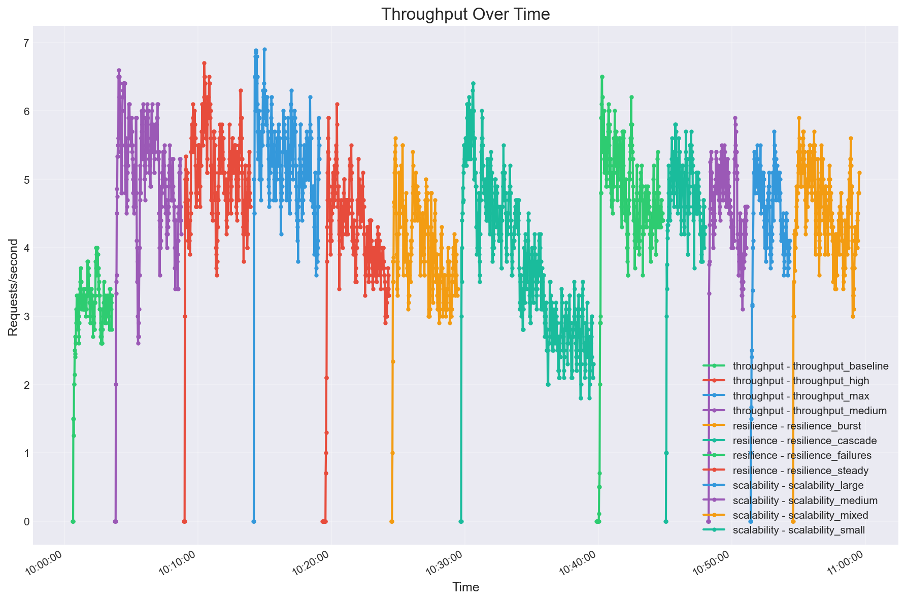
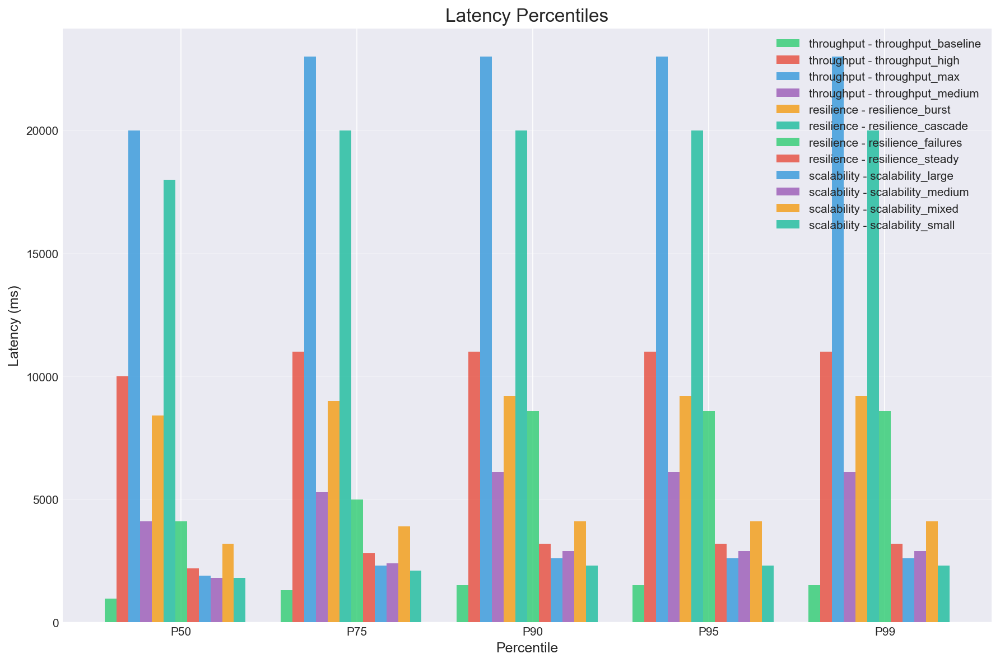
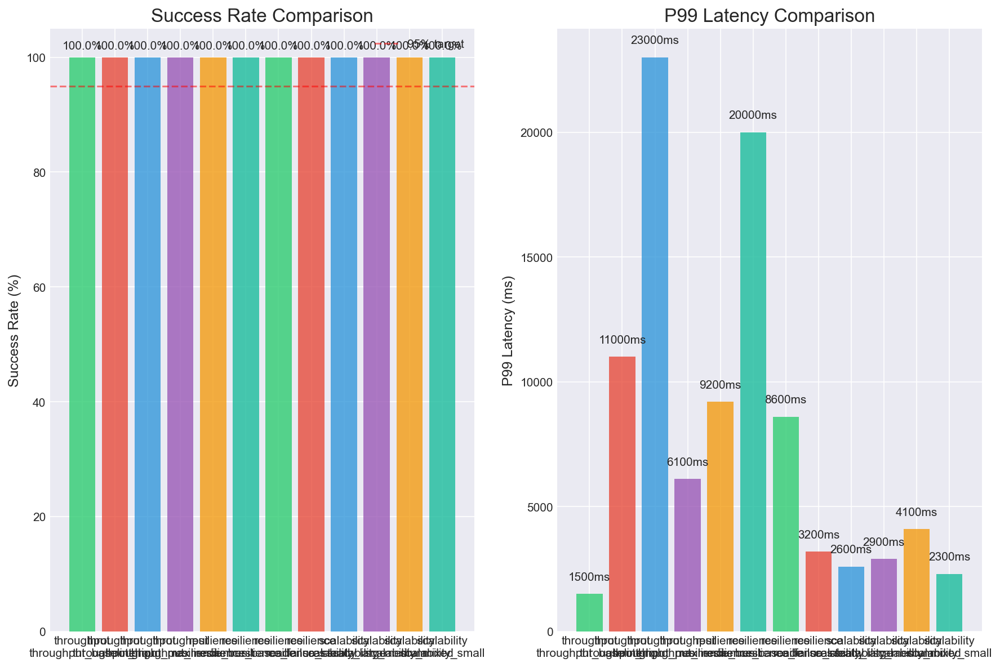

## TerraFix Experiment Analysis

Run timestamp (from `experiment_results/experiment_summary.json`): **2025-12-12T10:59:44**

Because of several issues encountered throughout the development process, the experiments are unfortunately not as comprehensive as they could be and also very flawed. The latency and cost of some external services like Vanta and Bedrock (or any other inference provider with any other SOTA reasoning LLM) are too high to be included in the load-test experiments.

### TL;DR (what mattered)
- **Zero request failures** across all runs (Locust `*_failures.csv` and `*_exceptions.csv` are empty), so the service stayed up.
- **Throughput hard-capped around ~5 requests/sec** on this setup. After that, adding users mostly just **inflated latency** (P99 hit **23s**).
- **“Resilience w/ failures” didn’t actually inject failures** in this run (details below), so I can’t honestly claim anything about retry/recovery behavior from the data I have.
- **Repo “size” barely moved the needle** in the scalability runs, but that’s mostly because the workload isn’t truly isolating sizes right now (again: details below).

---

## What I actually measured (so nobody gets lied to by charts)

### Test harness (high level)
- **Load generator**: Locust (`src/terrafix/experiments/locustfile.py`)
- **Target**: TerraFix API server, hitting:
  - `POST /webhook` (single “failure” payload)
  - `POST /batch` (batch payloads in some workloads)
  - occasional `GET /health` and `GET /status` (depending on workload)
- **Result source of truth**: the “Aggregated” row in each Locust `*_stats.csv`, also summarized in `experiment_results/experiment_summary.json`.

### Big constraints / limitations of this run
- **Mock mode**: the guide + code path are explicitly designed to run in mock mode locally (LocalStack doesn’t support Bedrock), so this run mostly stress-tests the **HTTP + orchestration + state-store paths**, not real “Bedrock latency” or real “GitHub rate limits”.
- **Failure injection wasn’t applied to the API server**:
  - `resilience_failures` sets `TERRAFIX_MOCK_FAILURE_RATE=0.1` as `extra_env` in `src/terrafix/experiments/run_experiments.py`, but that env var is only passed to the **Locust** process.
  - The **API server** (the one that reads `TERRAFIX_MOCK_FAILURE_RATE`) gets started separately in `start_mock_server()` with only `TERRAFIX_MOCK_LATENCY_MS=50` set.
  - Net effect: the “failures” run behaves like a mixed workload, not a failure/retry drill.
- **Scalability “small/medium/large” runs are not isolated**:
  - The Locust `ScalabilityUser` randomly chooses repo sizes per request, even when the runner sets `TERRAFIX_REPO_SIZE` for a given run.
  - So those “small/medium/large” labels are more like “which config I invoked”, not “a clean A/B test.”

---

## Experiment 1 — Throughput + Bottleneck Behavior

### Purpose (and the tradeoff I was poking)
I wanted to find the **max sustainable throughput** and see where TerraFix starts trading **latency** for **throughput**.

This is basically the classic tradeoff:
- **Let everything in**: high throughput *on paper*, but you risk unbounded queues and gross tail latency.
- **Apply backpressure** (rate limits / bounded queues): lower peak throughput, but sane latency and faster recovery.

### Results

| Run | Users | RPS | P50 | P95 | P99 | Failures |
|---|---:|---:|---:|---:|---:|---:|
| throughput_baseline | 5 | 3.16 | 380ms | 1.10s | 1.50s | 0 |
| throughput_medium | 20 | 5.07 | 2.90s | 4.60s | 6.10s | 0 |
| throughput_high | 50 | 5.12 | 8.70s | 11.0s | 11.0s | 0 |
| throughput_max | 100 | 5.28 | 18.0s | 21.0s | 23.0s | 0 |

### Charts

Throughput over time (all runs, but focus on the `throughput_*` series):

Latency percentiles (again: focus on the `throughput_*` bars):

### Analysis (what evidence this revealed)
- **Throughput plateaus around ~5 RPS** from 20 users all the way to 100 users.
  - That’s the strongest signal in the entire dataset.
  - If adding 5× more users doesn’t increase RPS, that’s not “we need more load” — that’s “we hit a bottleneck.”
- **Latency explodes past the knee of the curve**.
  - P50 goes from **0.38s → 18s** while RPS barely moves.
  - That’s textbook queueing behavior: work piles up somewhere and requests wait their turn.
- **Reliability stayed perfect** (0 failures), which is good — but also slightly suspicious in the “do we have backpressure?” sense.
  - A system can be “100% successful” while still being unusable if P99 is 23 seconds.

### Conclusions (based on this evidence)
- On this setup, TerraFix’s mock-mode request path has an effective capacity of **~5 requests/sec**.
- After that point, the system chooses **availability over responsiveness**: requests complete, but the tail latency becomes painful.

### Limitations
- These are **local, mock-mode** numbers. The shape of the curve (plateau + tail latency explosion) is meaningful; the exact RPS isn’t something I’d publish as a production capacity claim.
- Locust `constant_pacing(1)` means users *aim* for 1 req/sec, but once latency gets huge, the load generator self-throttles (you can’t send requests faster than responses complete).

---

## Experiment 2 — Resilience under Duplicates + Bursty Traffic

### Purpose (and the tradeoff I was poking)
This experiment is less about “how fast can we go” and more about “do we stay sane when traffic gets messy.”

The tradeoffs I was trying to surface:
- **Do work vs skip work**: if dedup is working, duplicates should get short-circuited (fast) instead of reprocessing the same thing (slow + expensive).
- **Absorb spikes vs push back**: under burst/cascade patterns, does the system keep serving requests, or does it spiral into timeouts and errors?
- **Chaos testing (intended)**: the “failures” run was supposed to simulate error conditions and see if retries/recovery behave.

### Workload (what the load generator did)
- **Steady** (`resilience_steady`): mix of unique + duplicate failures (about 80/20), moderate pacing.
- **Burst** (`resilience_burst`): rapid-fire requests with lots of batch submissions (`/batch`), meant to create micro-spikes.
- **Cascade** (`resilience_cascade`): batches that grow over time, meant to find “breaking points.”
- **Failures** (`resilience_failures`): mixed workload, *intended* to include 10% simulated failures.

### Results

| Run | Users | Workload pattern | RPS | P50 | P95 | P99 | Failures |
|---|---:|---|---:|---:|---:|---:|---:|
| resilience_steady | 10 | unique + 20% duplicates | 4.13 | 1.40s | 2.40s | 3.20s | 0 |
| resilience_burst | 30 | bursty batches | 3.97 | 6.40s | 8.70s | 9.20s | 0 |
| resilience_cascade | 50 | increasing rate over 10m | 3.76 | 11.0s | 19.0s | 20.0s | 0 |
| resilience_failures | 20 | mixed workload (no actual injected failures) | 4.73 | 2.90s | 4.50s | 8.60s | 0 |

### Charts

Success rate + P99 comparison (focus on the `resilience_*` bars):

### Analysis (what evidence this revealed)
- **The system stayed up** through burst and cascade patterns (0 Locust failures, 0 Locust exceptions).
- **But it’s still the same story as throughput**: when you spike the request rate, you pay in tail latency.
  - Burst: P50 ~6.4s, P99 ~9.2s
  - Cascade: P50 ~11s, P99 ~20s
- **I don’t have hard proof of dedup effectiveness from these artifacts alone**.
  - The load generator *did* send duplicates, but Locust metrics don’t tell me whether the server did “fast-path dedup” vs “full work again.”
  - To prove dedup is saving work, I’d want server-side metrics like “dedup hit rate” and “time spent in analysis vs skipped.”
- **The ‘failures’ run didn’t validate failure recovery**.
  - The results show 0 failures because the API server wasn’t actually configured with a nonzero `TERRAFIX_MOCK_FAILURE_RATE` for this run.

### Conclusions (based on this evidence)
- TerraFix can handle bursty and cascade-ish traffic patterns **without crashing**, but its latency under those patterns gets ugly fast once it’s near capacity.
- This run demonstrates **availability**, not necessarily **graceful degradation** (because we never forced error conditions).

### Limitations (what I can’t claim)
- I can’t claim anything meaningful about “retry success rates” or “recovery time” from this run, because failures weren’t injected.
- I can’t quantify how much dedup helps without server-side counters / tracing.

---

## Experiment 3 — Scalability vs Repository “size”

### Purpose (and the tradeoff I was poking)
This experiment was supposed to answer: “As repos get bigger/more complex, does Terraform analysis become the bottleneck?”

The underlying tradeoff:
- **Deeper analysis** catches more issues and produces better PRs…
- …but it also costs CPU/time, which can cap throughput and inflate tail latency.

### Results

| Run | Users | Label | RPS | P50 | P95 | P99 | Failures |
|---|---:|---|---:|---:|---:|---:|---:|
| scalability_small | 10 | “small” config invoked | 4.78 | 1.00s | 1.90s | 2.30s | 0 |
| scalability_medium | 10 | “medium” config invoked | 4.59 | 1.10s | 2.00s | 2.90s | 0 |
| scalability_large | 10 | “large” config invoked | 4.55 | 1.10s | 2.10s | 2.60s | 0 |
| scalability_mixed | 15 | mixed sizes | 4.57 | 2.20s | 3.50s | 4.10s | 0 |

### Analysis (what evidence this revealed)
- The “small/medium/large” runs are basically on top of each other: same ballpark P50/P99, same ballpark RPS.
- The only clear slowdown is **scalability_mixed**, and it also uses **more users (15 vs 10)**, so it’s probably measuring *concurrency pressure* more than “repo size pressure.”

### The uncomfortable truth / limitation
This run does **not** isolate repo size cleanly:
- The Locust `ScalabilityUser` randomly cycles through `small|medium|large` **on every request**.
- So the “scalability_small/medium/large” runs are not true size-separated benchmarks.

### Conclusions (based on this evidence)
- In this particular run (mock-mode + current workload shape), **repo size isn’t the dominant driver** of latency. Concurrency is.
- To actually measure scalability of Terraform analysis, the harness needs to:
  - isolate repo sizes per run (or record and segment by size), and
  - run a workload where “size” changes the server’s cost (real parsing, or a size-weighted mock).

---

## Cross-experiment conclusions

### The system is stable, but not “fast” under load
- Success stayed at **100%** in every run, which is great for availability.
- But the tail latency numbers prove that once you’re near capacity, the user experience becomes rough (P99 up to **23s**).

### The bottleneck is almost certainly on the request path
The plateau at ~5 RPS strongly suggests a fixed-capacity bottleneck (think: single-threaded / blocking section / limited worker concurrency). In production, the fix is rarely “make Python faster”; it’s usually “don’t do long work on the request thread.”

### What I’d change next
- **Add backpressure**: bounded queue + return `429`/`503` with `Retry-After` instead of letting latency balloon forever.
- **Decouple heavy work from HTTP**: accept requests quickly, enqueue jobs, process asynchronously, and provide status polling.
- **Fix the harness** so the experiments match the spec:
  - apply mock failure rate to the API server (or hit `/configure` before each run),
  - make scalability runs actually isolate size,
  - fix or remove the blank heatmap chart (`experiment_results/charts/latency_heatmap.png` came out empty in this run).

---

## Where the raw artifacts live

- **Summary**: `experiment_results/experiment_summary.json` and `experiment_results/experiment_summary.html`
- **Per-run HTML reports**:
  - Throughput: `experiment_results/throughput/*_report.html`
  - Resilience: `experiment_results/resilience/*_report.html`
  - Scalability: `experiment_results/scalability/*_report.html`
- **Charts used above**: `experiment_results/charts/`
