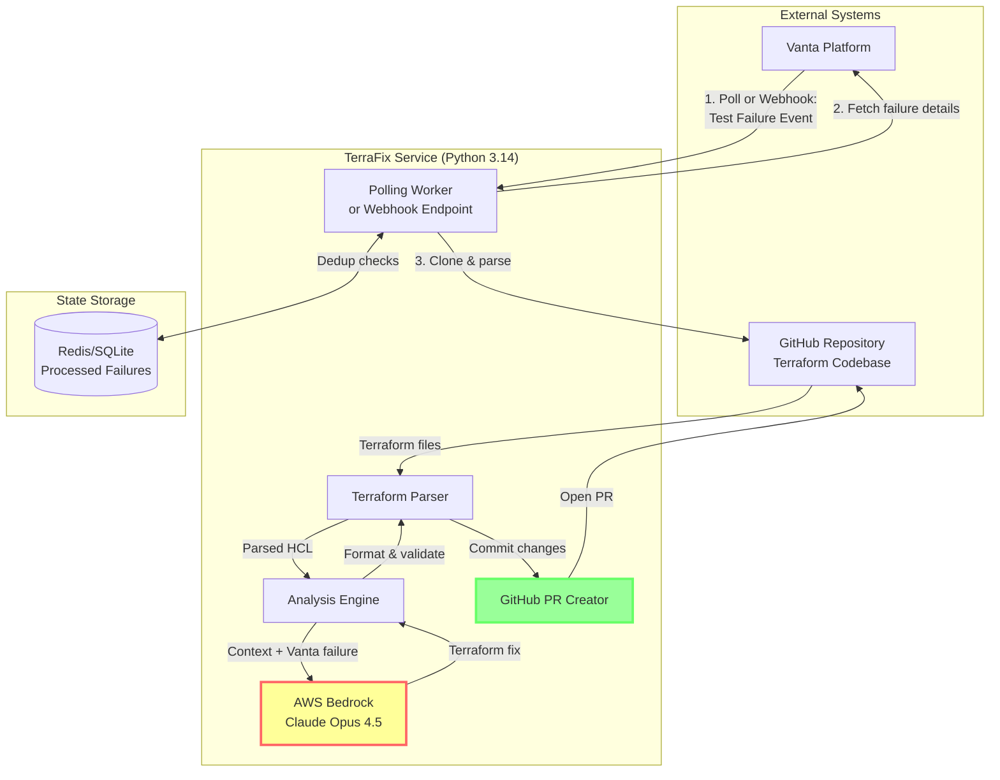

# TerraFix: AI-Powered Terraform Compliance Remediation Bot

## Executive Summary

**Problem**: Delve and similar tools face critical issues: autonomous AWS changes create permission nightmares, lack human oversight, and are conceptually problematic for production environments. Most codebases use Infrastructure as Code that can be fixed at the source.

**Solution**: TerraFix focuses exclusively on Terraform-based infrastructure. When Vanta detects compliance failures, I'll analyze the existing Terraform configuration, generate a compliant fix using Claude Opus 4.5 via AWS Bedrock, and open a GitHub Pull Request for human review. This sidesteps permission issues entirely - the only permissions I need are Vanta API access (read-only) and GitHub PR creation.

**Key Differentiator from Delve**: Human-in-the-loop architecture. No direct AWS access required. I work at the IaC layer where changes belong.

---

## Testing Strategy

**Unit Tests**: I'll mock external dependencies using responses library for HTTP APIs and VCR.py for recording/replaying API interactions. Each test verifies one specific behavior and runs in milliseconds. I'll use pytest fixtures for common test data and parametrize to test multiple scenarios with the same logic.

**Integration Tests**: I'll test components working together using real implementations. My test repository will contain intentionally misconfigured Terraform resources triggering known compliance failures. I'll create fresh test branches for each test run and clean up afterwards.

**Load Tests**: I'll build a synthetic workload generator using my scalability experiment harness. This generates realistic failures with varying repository sizes and complexity levels. I'll collect detailed timing metrics at each pipeline stage for analysis.

**CI Pipeline**: GitHub Actions runs unit tests on every commit, integration tests on PRs to main, and load tests nightly. I'll enforce linting (ruff), type checking (mypy), and security scanning (bandit) before running tests. Caching pip packages and Docker layers reduces build time from 10 minutes to 2-3 minutes.

**Debugging**: Every request gets a unique correlation ID that flows through all components and appears in logs. I'll log full Bedrock prompts/responses (redacted) for debugging prompt engineering issues. For flaky tests that depend on timing or external state, I'll either fix the flakiness through better test isolation or mark them for manual verification.

---

## Architecture



---

## Component Breakdown

### 1. Vanta Integration Layer

**Purpose**: Detect compliance failures without requiring AWS access.

**Implementation**:
```python
"""
Vanta API client for polling compliance test failures.

Uses Vanta's REST API to detect when tests fail, then triggers
the remediation pipeline. Maintains state to avoid duplicate processing.
"""

import requests
from datetime import datetime, timedelta
from typing import List, Dict, Optional
import hashlib


class VantaClient:
    """
    Client for interacting with Vanta's compliance API.
    
    Attributes:
        api_token: OAuth token for Vanta API authentication
        base_url: Vanta API base URL (https://api.vanta.com)
        session: Persistent HTTP session for connection pooling
    """
    
    def __init__(self, api_token: str):
        """
        Initialize Vanta API client.
        
        Args:
            api_token: Vanta OAuth token with test:read scope
        """
        self.api_token = api_token
        self.base_url = "https://api.vanta.com"
        self.session = requests.Session()
        self.session.headers.update({
            "Authorization": f"Bearer {api_token}",
            "Content-Type": "application/json"
        })
    
    def get_failing_tests(
        self,
        frameworks: Optional[List[str]] = None,
        since: Optional[datetime] = None
    ) -> List[Dict]:
        """
        Retrieve all currently failing tests.
        
        Args:
            frameworks: Filter by framework (SOC2, ISO27001, etc.)
            since: Only return failures since this timestamp
            
        Returns:
            List of test failure objects containing:
            - test_id: Unique test identifier
            - test_name: Human-readable test name
            - resource_arn: AWS resource ARN (if applicable)
            - resource_type: Resource type (AWS::S3::Bucket, etc.)
            - failure_reason: Why the test failed
            - severity: high/medium/low
            - framework: Compliance framework
            - failed_at: Timestamp of failure
            - current_state: Current resource configuration
            - required_state: Required configuration for compliance
        """
        # Vanta API pagination example
        failures = []
        page_cursor = None
        
        while True:
            params = {
                "status": "failing",
                "pageSize": 50
            }
            
            if page_cursor:
                params["pageCursor"] = page_cursor
            
            if frameworks:
                params["frameworks"] = ",".join(frameworks)
            
            response = self.session.get(
                f"{self.base_url}/v1/tests",
                params=params
            )
            response.raise_for_status()
            
            data = response.json()
            batch = data.get("results", {}).get("data", [])
            
            # Filter by timestamp if provided
            if since:
                batch = [
                    t for t in batch 
                    if datetime.fromisoformat(t["failed_at"]) > since
                ]
            
            failures.extend(batch)
            
            # Check for more pages
            page_info = data.get("results", {}).get("pageInfo", {})
            if not page_info.get("hasNextPage"):
                break
            
            page_cursor = page_info.get("endCursor")
        
        # Enrich with resource details for AWS resources
        return [self._enrich_failure(f) for f in failures]
    
    def _enrich_failure(self, failure: Dict) -> Dict:
        """
        Enrich failure with additional resource metadata.
        
        Args:
            failure: Basic failure object from Vanta
            
        Returns:
            Enriched failure with resource details
        """
        # Fetch detailed resource information
        resource_id = failure.get("resource_id")
        if resource_id:
            try:
                resource_response = self.session.get(
                    f"{self.base_url}/v1/resources/{resource_id}"
                )
                resource_response.raise_for_status()
                resource_data = resource_response.json()
                
                failure["resource_details"] = resource_data
            except requests.HTTPError:
                pass  # Continue without enrichment
        
        return failure
    
    def generate_failure_hash(self, failure: Dict) -> str:
        """
        Generate deterministic hash for deduplication.
        
        Args:
            failure: Test failure object
            
        Returns:
            SHA256 hash of failure signature
        """
        signature = (
            f"{failure['test_id']}-"
            f"{failure['resource_arn']}-"
            f"{failure['failed_at']}"
        )
        return hashlib.sha256(signature.encode()).hexdigest()
```

**Key Design Decisions**:

- **Polling vs Webhooks**: Vanta doesn't have native webhook support (as of November 2025), so we poll every 5 minutes. This is acceptable for compliance workflows which aren't time-critical.
- **Deduplication**: Use failure hash to avoid processing the same failure multiple times.
- **Read-Only Access**: Only requires `test:read` scope - no write permissions needed.

---

### 2. Terraform Analysis Engine

**Purpose**: Parse existing Terraform configuration and identify the specific resources that need remediation.

**Implementation**:
```python
"""
Terraform configuration parser and analyzer.

Uses python-hcl2 to parse Terraform files and identify
resources that correspond to Vanta compliance failures.
"""

import hcl2
from pathlib import Path
from typing import Dict, List, Optional, Tuple
import re


class TerraformAnalyzer:
    """
    Analyzes Terraform configurations to locate and understand
    resources that need compliance remediation.
    
    Attributes:
        repo_path: Path to cloned Terraform repository
        terraform_files: List of .tf file paths
        parsed_configs: Parsed HCL configurations
    """
    
    def __init__(self, repo_path: str):
        """
        Initialize Terraform analyzer.
        
        Args:
            repo_path: Path to repository containing Terraform files
        """
        self.repo_path = Path(repo_path)
        self.terraform_files = list(self.repo_path.rglob("*.tf"))
        self.parsed_configs = {}
        self._parse_all_files()
    
    def _parse_all_files(self) -> None:
        """
        Parse all Terraform files in the repository.
        
        Stores parsed configurations in self.parsed_configs
        with file paths as keys.
        """
        for tf_file in self.terraform_files:
            try:
                with open(tf_file, 'r', encoding='utf-8') as f:
                    content = f.read()
                    # python-hcl2 parses Terraform HCL
                    parsed = hcl2.loads(content)
                    self.parsed_configs[str(tf_file)] = {
                        "content": content,
                        "parsed": parsed
                    }
            except Exception as e:
                # Log but continue - some files may have syntax errors
                print(f"Warning: Failed to parse {tf_file}: {e}")
    
    def find_resource_by_arn(
        self,
        resource_arn: str,
        resource_type: str
    ) -> Optional[Tuple[str, Dict, str]]:
        """
        Locate a Terraform resource block by AWS ARN.
        
        Args:
            resource_arn: AWS resource ARN
            resource_type: AWS resource type (AWS::S3::Bucket, etc.)
            
        Returns:
            Tuple of (file_path, resource_block, resource_name) or None
            
        Example:
            Given ARN arn:aws:s3:::my-bucket, returns:
            ("terraform/s3.tf", {...resource block...}, "my-bucket")
        """
        # Map AWS resource types to Terraform resource types
        tf_type = self._aws_to_terraform_type(resource_type)
        
        # Extract resource name from ARN
        resource_name = self._extract_name_from_arn(resource_arn)
        
        # Search all parsed configs
        for file_path, config in self.parsed_configs.items():
            parsed = config["parsed"]
            
            # Look for matching resource blocks
            if "resource" in parsed:
                for resources in parsed["resource"]:
                    for res_type, res_instances in resources.items():
                        if res_type == tf_type:
                            for res_name, res_config in res_instances.items():
                                # Match by name or by inline ARN/ID
                                if (res_name == resource_name or
                                    self._resource_matches_arn(
                                        res_config, resource_arn
                                    )):
                                    return (
                                        file_path,
                                        res_config,
                                        res_name
                                    )
        
        return None
    
    def _aws_to_terraform_type(self, aws_type: str) -> str:
        """
        Convert AWS CloudFormation type to Terraform type.
        
        Args:
            aws_type: CloudFormation resource type
            
        Returns:
            Terraform resource type
            
        Examples:
            AWS::S3::Bucket -> aws_s3_bucket
            AWS::IAM::Role -> aws_iam_role
        """
        # Remove AWS:: prefix and convert to lowercase snake_case
        parts = aws_type.replace("AWS::", "").split("::")
        return "aws_" + "_".join(p.lower() for p in parts)
    
    def _extract_name_from_arn(self, arn: str) -> str:
        """
        Extract resource name from ARN.
        
        Args:
            arn: AWS ARN
            
        Returns:
            Resource name
            
        Examples:
            arn:aws:s3:::bucket-name -> bucket-name
            arn:aws:iam::123456:role/RoleName -> RoleName
        """
        # S3 bucket ARN pattern
        if ":s3:::" in arn:
            return arn.split(":::")[-1].split("/")[0]
        
        # Most other ARNs
        if "/" in arn:
            return arn.split("/")[-1]
        
        # Fallback: return last component
        return arn.split(":")[-1]
    
    def _resource_matches_arn(
        self,
        resource_config: Dict,
        arn: str
    ) -> bool:
        """
        Check if Terraform resource configuration matches ARN.
        
        Args:
            resource_config: Terraform resource configuration block
            arn: AWS ARN to match against
            
        Returns:
            True if resource matches ARN
        """
        # Check for explicit ARN in config
        if "arn" in resource_config:
            return resource_config["arn"] == arn
        
        # Check for bucket name in S3 resources
        if "bucket" in resource_config:
            bucket_name = self._extract_name_from_arn(arn)
            return resource_config["bucket"] == bucket_name
        
        return False
    
    def get_module_context(self, file_path: str) -> Dict:
        """
        Get module-level context for a file.
        
        Args:
            file_path: Path to Terraform file
            
        Returns:
            Dict containing:
            - provider_config: Provider configuration
            - variables: Input variables
            - outputs: Output definitions
            - module_calls: Other module references
        """
        parsed = self.parsed_configs.get(file_path, {}).get("parsed", {})
        
        return {
            "provider": parsed.get("provider", []),
            "variable": parsed.get("variable", []),
            "output": parsed.get("output", []),
            "module": parsed.get("module", []),
        }
```

**Key Design Decisions**:

- **HCL Parsing**: Use `python-hcl2` library which properly handles Terraform 1.x syntax.
- **Resource Matching**: Map Vanta's AWS resource identifiers to Terraform resource names.
- **Context Awareness**: Capture surrounding module context for better fix generation.

---

### 3. Claude Integration via Bedrock

**Purpose**: Generate Terraform fixes using Claude's understanding of both compliance requirements and Terraform best practices.

**Implementation**:
```python
"""
AWS Bedrock client for Terraform remediation generation.

Constructs prompts with full context about the compliance failure
and existing Terraform configuration, then uses Claude to generate
a compliant fix in proper HCL format.
"""

import boto3
import json
from typing import Dict, Optional
from botocore.exceptions import ClientError


class TerraformRemediationGenerator:
    """
    Generates Terraform configuration fixes using Claude via Bedrock.
    
    Attributes:
        bedrock_client: Boto3 Bedrock Runtime client
        model_id: Claude model identifier
    """
    
    def __init__(
        self,
        model_id: str = "anthropic.claude-opus-4-5-20251101-v1:0",
        region: str = "us-west-2"
    ):
        """
        Initialize Bedrock Claude client.
        
        Args:
            model_id: Claude model ID (default: Opus 4.5)
            region: AWS region for Bedrock
        """
        self.bedrock_client = boto3.client(
            service_name="bedrock-runtime",
            region_name=region
        )
        self.model_id = model_id
    
    def generate_fix(
        self,
        failure: Dict,
        current_config: str,
        resource_block: Dict,
        module_context: Dict
    ) -> Dict[str, str]:
        """
        Generate Terraform configuration fix.
        
        Args:
            failure: Vanta test failure details
            current_config: Current Terraform file content
            resource_block: Specific resource block that failed
            module_context: Surrounding module context
            
        Returns:
            Dict containing:
            - fixed_config: Updated Terraform configuration
            - explanation: Human-readable explanation of changes
            - diff: Git-style diff of changes
            - confidence: high/medium/low
        """
        prompt = self._construct_prompt(
            failure,
            current_config,
            resource_block,
            module_context
        )
        
        try:
            response = self._invoke_claude(prompt)
            return self._parse_response(response)
        except ClientError as e:
            raise RuntimeError(f"Bedrock API error: {e}")
    
    def _construct_prompt(
        self,
        failure: Dict,
        current_config: str,
        resource_block: Dict,
        module_context: Dict
    ) -> str:
        """
        Construct detailed prompt for Claude.
        
        Includes:
        - Compliance requirement details
        - Current Terraform configuration
        - Terraform best practices context
        - Expected output format
        """
        return f"""You are a senior DevOps engineer and compliance expert specializing in Terraform and AWS security best practices.

# COMPLIANCE FAILURE

**Test**: {failure['test_name']}
**Severity**: {failure['severity']}
**Framework**: {failure['framework']}
**Resource**: {failure['resource_arn']}
**Resource Type**: {failure['resource_type']}

**Failure Reason**: {failure['failure_reason']}

**Current State**:
```json
{json.dumps(failure.get('current_state', {}), indent=2)}
```

**Required State**:
```json
{json.dumps(failure.get('required_state', {}), indent=2)}
```

# CURRENT TERRAFORM CONFIGURATION

```hcl
{current_config}
```

# TASK

Generate a Terraform configuration fix that:
1. Addresses the compliance failure completely
2. Maintains existing resource dependencies
3. Follows Terraform best practices (style guide, naming conventions)
4. Uses proper HCL syntax compatible with Terraform 1.0+
5. Preserves any existing tags, lifecycle rules, or metadata
6. Includes appropriate inline comments explaining security controls

# TERRAFORM DOCUMENTATION CONTEXT

{self._get_terraform_docs_for_resource(failure['resource_type'])}

# RESPONSE FORMAT (JSON)

Respond ONLY with valid JSON in this exact format (no markdown, no preamble):

{{
  "fixed_config": "<complete updated Terraform file content>",
  "explanation": "<human-readable explanation of changes>",
  "changed_attributes": ["attribute1", "attribute2"],
  "reasoning": "<why these changes address the compliance failure>",
  "confidence": "high|medium|low",
  "breaking_changes": "<any potential breaking changes or migration notes>",
  "additional_requirements": "<any manual steps required after applying>"
}}

# CRITICAL REQUIREMENTS

- The fix MUST be syntactically valid HCL
- Do NOT change resource names or identifiers
- Do NOT remove existing configuration unless necessary
- Preserve all comments and formatting where possible
- Use terraform fmt style conventions

Generate the JSON response now:"""
    
    def _get_terraform_docs_for_resource(
        self,
        resource_type: str
    ) -> str:
        """
        Get relevant Terraform documentation for resource type.
        
        In production, this would fetch from Terraform Registry API.
        For hackathon, we include common patterns inline.
        """
        # Simplified docs - in production, fetch dynamically
        docs_map = {
            "AWS::S3::Bucket": """
## aws_s3_bucket Block Public Access

```hcl
resource "aws_s3_bucket_public_access_block" "example" {
  bucket = aws_s3_bucket.example.id

  block_public_acls       = true
  block_public_policy     = true
  ignore_public_acls      = true
  restrict_public_buckets = true
}
```

## aws_s3_bucket Server-Side Encryption

```hcl
resource "aws_s3_bucket_server_side_encryption_configuration" "example" {
  bucket = aws_s3_bucket.example.id

  rule {
    apply_server_side_encryption_by_default {
      sse_algorithm = "AES256"
    }
  }
}
```
""",
            "AWS::IAM::Role": """
## aws_iam_role with Trust Policy

```hcl
resource "aws_iam_role" "example" {
  name = "example-role"
  
  assume_role_policy = jsonencode({
    Version = "2012-10-17"
    Statement = [{
      Action = "sts:AssumeRole"
      Effect = "Allow"
      Principal = {
        Service = "lambda.amazonaws.com"
      }
    }]
  })
  
  # Recommended: Set maximum session duration
  max_session_duration = 3600
  
  tags = {
    Environment = "production"
  }
}
```
"""
        }
        
        return docs_map.get(resource_type, "# No specific docs available")
    
    def _invoke_claude(self, prompt: str) -> Dict:
        """
        Call Bedrock to invoke Claude Opus 4.5.
        
        Args:
            prompt: Constructed prompt with failure context
            
        Returns:
            Raw Bedrock API response
        """
        body = {
            "anthropic_version": "bedrock-2023-05-31",
            "max_tokens": 4096,
            "messages": [
                {
                    "role": "user",
                    "content": prompt
                }
            ],
            "temperature": 0.1,  # Low temperature for consistency
            "top_p": 0.9
        }
        
        response = self.bedrock_client.invoke_model(
            modelId=self.model_id,
            body=json.dumps(body),
            contentType="application/json",
            accept="application/json"
        )
        
        return json.loads(response["body"].read())
    
    def _parse_response(self, response: Dict) -> Dict[str, str]:
        """
        Extract structured fix from Claude's response.
        
        Args:
            response: Raw Bedrock response
            
        Returns:
            Parsed remediation with fixed_config, explanation, etc.
        """
        content = response.get("content", [])
        if not content:
            raise ValueError("Empty Claude response")
        
        text = content[0].get("text", "").strip()
        
        # Claude may wrap JSON in markdown code blocks
        if "```json" in text:
            text = text.split("```json")[1].split("```")[0].strip()
        elif "```" in text:
            text = text.split("```")[1].split("```")[0].strip()
        
        try:
            parsed = json.loads(text)
        except json.JSONDecodeError as e:
            raise ValueError(f"Invalid JSON from Claude: {e}\nText: {text}")
        
        # Validate required fields
        required = ["fixed_config", "explanation", "confidence"]
        for field in required:
            if field not in parsed:
                raise ValueError(f"Missing field: {field}")
        
        return parsed
```

**Key Design Decisions**:

- **Temperature 0.1**: Very low temperature for deterministic, conservative fixes.
- **Documentation Context**: Include relevant Terraform docs in prompt for accuracy.
- **JSON Output**: Structured output makes parsing reliable and enables automated validation.

---

### 4. GitHub PR Generator

**Purpose**: Create well-formatted Pull Requests with comprehensive context for reviewers.

**Implementation**:
```python
"""
GitHub integration for creating Pull Requests with Terraform fixes.

Uses PyGithub to clone repos, create branches, commit changes,
and open PRs with rich context for reviewers.
"""

from github import Github, GithubException
from typing import Dict, Optional
import tempfile
import subprocess
from pathlib import Path


class GitHubPRCreator:
    """
    Handles Git operations and GitHub PR creation.
    
    Attributes:
        gh_client: PyGithub client instance
        token: GitHub personal access token
    """
    
    def __init__(self, github_token: str):
        """
        Initialize GitHub client.
        
        Args:
            github_token: GitHub PAT with repo scope
        """
        self.gh_client = Github(github_token)
        self.token = github_token
    
    def create_remediation_pr(
        self,
        repo_full_name: str,
        file_path: str,
        new_content: str,
        failure: Dict,
        fix_metadata: Dict,
        base_branch: str = "main"
    ) -> str:
        """
        Create Pull Request with Terraform fix.
        
        Args:
            repo_full_name: GitHub repo (owner/repo)
            file_path: Path to file being modified
            new_content: Fixed Terraform configuration
            failure: Original Vanta failure details
            fix_metadata: Claude's fix metadata (explanation, etc.)
            base_branch: Target branch for PR
            
        Returns:
            Pull Request URL
        """
        repo = self.gh_client.get_repo(repo_full_name)
        
        # Create branch name
        branch_name = self._generate_branch_name(failure)
        
        # Check if branch already exists (avoid duplicates)
        try:
            repo.get_branch(branch_name)
            print(f"Branch {branch_name} already exists, skipping")
            return None
        except GithubException:
            pass  # Branch doesn't exist, continue
        
        # Get base branch reference
        base_ref = repo.get_git_ref(f"heads/{base_branch}")
        base_sha = base_ref.object.sha
        
        # Create new branch
        repo.create_git_ref(
            ref=f"refs/heads/{branch_name}",
            sha=base_sha
        )
        
        # Update file on new branch
        try:
            # Get current file to obtain its SHA
            file_content = repo.get_contents(file_path, ref=base_branch)
            
            # Commit updated file
            commit_message = self._generate_commit_message(failure)
            
            repo.update_file(
                path=file_path,
                message=commit_message,
                content=new_content,
                sha=file_content.sha,
                branch=branch_name
            )
        except GithubException as e:
            print(f"Error updating file: {e}")
            raise
        
        # Create Pull Request
        pr_title = self._generate_pr_title(failure)
        pr_body = self._generate_pr_body(
            failure,
            fix_metadata,
            file_path
        )
        
        pr = repo.create_pull(
            title=pr_title,
            body=pr_body,
            head=branch_name,
            base=base_branch
        )
        
        # Add labels
        labels = self._determine_labels(failure)
        pr.add_to_labels(*labels)
        
        return pr.html_url
    
    def _generate_branch_name(self, failure: Dict) -> str:
        """
        Generate descriptive branch name.
        
        Args:
            failure: Vanta failure details
            
        Returns:
            Branch name like: terrafix/s3-block-public-access-1234
        """
        test_slug = failure['test_name'].lower()\
            .replace(" ", "-")\
            .replace("_", "-")[:50]
        
        # Add short hash for uniqueness
        import hashlib
        hash_suffix = hashlib.md5(
            failure['test_id'].encode()
        ).hexdigest()[:8]
        
        return f"terrafix/{test_slug}-{hash_suffix}"
    
    def _generate_commit_message(self, failure: Dict) -> str:
        """
        Generate conventional commit message.
        
        Args:
            failure: Vanta failure details
            
        Returns:
            Commit message following conventional commits format
        """
        return f"""fix(compliance): {failure['test_name']}

Automated fix generated by TerraFix to address compliance failure.

Test: {failure['test_name']}
Framework: {failure['framework']}
Severity: {failure['severity']}
Resource: {failure['resource_arn']}

This commit was automatically generated. Please review carefully
before merging.
"""
    
    def _generate_pr_title(self, failure: Dict) -> str:
        """Generate concise PR title."""
        severity_emoji = {
            "high": "🔴",
            "medium": "🟡",
            "low": "🟢"
        }
        emoji = severity_emoji.get(failure['severity'], "⚪")
        
        return f"{emoji} [TerraFix] {failure['test_name']}"
    
    def _generate_pr_body(
        self,
        failure: Dict,
        fix_metadata: Dict,
        file_path: str
    ) -> str:
        """
        Generate comprehensive PR description.
        
        Args:
            failure: Vanta failure details
            fix_metadata: Claude's fix explanation
            file_path: Modified file path
            
        Returns:
            Markdown-formatted PR body
        """
        return f"""## 🤖 Automated Compliance Remediation

This PR was automatically generated by TerraFix to address a compliance failure detected by Vanta.

### 📋 Compliance Failure Details

| Field | Value |
|-------|-------|
| **Test** | {failure['test_name']} |
| **Framework** | {failure['framework']} |
| **Severity** | {failure['severity'].upper()} |
| **Resource** | `{failure['resource_arn']}` |
| **Failed At** | {failure.get('failed_at', 'N/A')} |

**Failure Reason**: {failure['failure_reason']}

### 🔧 Changes Made

**Modified File**: `{file_path}`

**Changed Attributes**: {', '.join(f"`{attr}`" for attr in fix_metadata.get('changed_attributes', []))}

### 📝 Explanation

{fix_metadata['explanation']}

### 🧠 Reasoning

{fix_metadata.get('reasoning', 'See explanation above.')}

### ⚠️ Review Checklist

Before merging this PR, please verify:

- [ ] The changes correctly address the compliance failure
- [ ] No breaking changes are introduced
- [ ] Resource names and identifiers are unchanged
- [ ] Existing tags and metadata are preserved
- [ ] The fix follows your team's Terraform conventions
- [ ] `terraform plan` shows expected changes only

### 🔄 Breaking Changes

{fix_metadata.get('breaking_changes', 'None identified')}

### 📌 Additional Requirements

{fix_metadata.get('additional_requirements', 'None')}

### 🤝 Review Confidence

AI Confidence: **{fix_metadata['confidence'].upper()}**

{self._get_confidence_guidance(fix_metadata['confidence'])}

---

<details>
<summary>View Current vs Required State</summary>

**Current State**:
```json
{json.dumps(failure.get('current_state', {}), indent=2)}
```

**Required State**:
```json
{json.dumps(failure.get('required_state', {}), indent=2)}
```

</details>

---

*Generated by [TerraFix](https://github.com/your-team/terrafix) - AI-Powered Terraform Compliance Remediation*
"""
    
    def _get_confidence_guidance(self, confidence: str) -> str:
        """Provide review guidance based on confidence level."""
        guidance = {
            "high": "✅ This fix has high confidence. Review should be straightforward.",
            "medium": "⚠️ This fix has medium confidence. Extra scrutiny recommended.",
            "low": "❌ This fix has low confidence. Thorough review required."
        }
        return guidance.get(confidence, "")
    
    def _determine_labels(self, failure: Dict) -> list:
        """
        Determine appropriate GitHub labels for PR.
        
        Args:
            failure: Vanta failure details
            
        Returns:
            List of label names to apply
        """
        labels = ["compliance", "automated", "terrafix"]
        
        # Add severity label
        labels.append(f"severity:{failure['severity']}")
        
        # Add framework label
        labels.append(f"framework:{failure['framework'].lower()}")
        
        return labels
```

**Key Design Decisions**:

- **Rich PR Context**: Comprehensive descriptions help reviewers understand changes quickly.
- **Conventional Commits**: Follow commit message standards for better git history.
- **Review Checklist**: Explicit checklist ensures thorough human review.
- **Confidence Levels**: Claude's confidence score guides review depth.

---

## Deployment Architecture

### Option A: Serverless (AWS Lambda)

```python
"""
AWS Lambda handler for serverless deployment.

Triggers on CloudWatch Events (scheduled polling) or API Gateway
(webhook endpoint).
"""

import json
import os
from vanta_client import VantaClient
from terraform_analyzer import TerraformAnalyzer
from remediation_generator import TerraformRemediationGenerator
from github_pr_creator import GitHubPRCreator
import boto3


def lambda_handler(event, context):
    """
    Main Lambda entry point.
    
    Supports two invocation methods:
    1. CloudWatch Events (scheduled polling)
    2. API Gateway (webhook from external system)
    """
    # Initialize clients from environment variables
    vanta = VantaClient(os.environ['VANTA_API_TOKEN'])
    generator = TerraformRemediationGenerator()
    gh = GitHubPRCreator(os.environ['GITHUB_TOKEN'])
    
    # Determine invocation source
    if 'source' in event and event['source'] == 'aws.events':
        # Scheduled polling
        failures = vanta.get_failing_tests(
            frameworks=['SOC2', 'ISO27001']
        )
    else:
        # Webhook/manual invocation
        failures = [event.get('failure')]
    
    results = []
    for failure in failures:
        try:
            result = process_failure(failure, vanta, generator, gh)
            results.append(result)
        except Exception as e:
            print(f"Error processing failure: {e}")
            results.append({"error": str(e), "failure": failure})
    
    return {
        "statusCode": 200,
        "body": json.dumps({
            "processed": len(results),
            "results": results
        })
    }


def process_failure(failure, vanta, generator, gh):
    """Process single failure and create PR."""
    # Implementation details from previous sections...
    pass
```

### Option B: Container Service (ECS/Fargate)

```python
"""
Long-running service for continuous monitoring.
"""

import time
from datetime import datetime, timedelta


def main():
    """Main service loop."""
    vanta = VantaClient(os.environ['VANTA_API_TOKEN'])
    generator = TerraformRemediationGenerator()
    gh = GitHubPRCreator(os.environ['GITHUB_TOKEN'])
    
    last_check = datetime.now() - timedelta(hours=1)
    
    while True:
        try:
            # Fetch failures since last check
            failures = vanta.get_failing_tests(since=last_check)
            
            for failure in failures:
                process_failure(failure, vanta, generator, gh)
            
            last_check = datetime.now()
            
            # Wait 5 minutes before next check
            time.sleep(300)
            
        except Exception as e:
            print(f"Service error: {e}")
            time.sleep(60)  # Back off on error


if __name__ == "__main__":
    main()
```

---

## Three-Week Development Timeline

### Week 1: Core Components (Days 1-7)

**Days 1-2: Environment & Vanta Integration**
- Set up Python 3.14 environment with dependencies (boto3, PyGithub, python-hcl2, requests)
- Create project structure with logging and configuration management
- Implement VantaClient class with OAuth, pagination, and failure enrichment
- Test API connection and implement deduplication with Redis
- Write unit tests using VCR cassettes for API mocking

**Days 3-4: Terraform Analysis**
- Implement TerraformAnalyzer with python-hcl2 for parsing
- Build resource matching logic (AWS ARN → Terraform resource blocks)
- Extract module context (providers, variables, outputs)
- Add caching for parsed configurations with TTL invalidation
- Test with small, medium, and large repository fixtures

**Days 5-7: Bedrock Integration**
- Implement TerraformRemediationGenerator with boto3 Bedrock client
- Design prompt templates with failure context and Terraform docs
- Build response parsing with validation and error handling
- Implement retry logic with exponential backoff for Bedrock failures
- Test with mock responses to avoid burning API credits

### Week 2: Integration & GitHub (Days 8-14)

**Days 8-9: GitHub PR Creation**
- Implement GitHubPRCreator with branch management and PR templates
- Build comprehensive PR description generation with review checklist
- Add label management for severity and framework categorization
- Test PR creation end-to-end with real test repository
- Implement rate limit handling for GitHub API

**Days 10-11: End-to-End Integration**
- Connect all components into main orchestration loop
- Implement concurrent failure processing with worker pool
- Add graceful error handling at each pipeline stage
- Build health check endpoint and basic metrics collection
- Test complete workflow from Vanta failure to GitHub PR

**Days 12-14: Basic Testing & Validation**
- Write integration tests covering S3, IAM, RDS, and security group fixes
- Implement terraform fmt and terraform validate checks before PR creation
- Add monitoring instrumentation at each pipeline stage
- Test error scenarios (Bedrock timeouts, GitHub rate limits, parse failures)
- Create test data generators for scalability experiments

### Week 3: Experiments & Deployment (Days 15-21)

**Days 15-16: Experiment One - Pipeline Throughput**
- Build synthetic failure generator with small/medium/large repository profiles
- Implement detailed timing instrumentation for each pipeline stage
- Run load tests ramping from 1 failure/30s to 10 concurrent failures
- Collect metrics on latency distributions (P50, P95, P99) at each stage
- Identify bottlenecks (compute, I/O, or API-bound)

**Days 17-18: Experiment Two - Failure Resilience**
- Design three workload patterns (steady-state, burst, cascade)
- Implement controlled failure injection (Bedrock throttling, GitHub rate limits, Git timeouts)
- Test deduplication under concurrent load with race conditions
- Measure retry success rates and error recovery time
- Verify queue depth stability during sustained failures

**Days 19-20: Experiment Three - Parsing Scalability**
- Construct test corpus spanning realistic repository complexity ranges
- Measure parsing time vs. repository size and syntactic complexity
- Track memory consumption patterns during parsing
- Test cache effectiveness and hit rates
- Evaluate prompt truncation strategies for large Terraform files

**Day 21: Documentation & Wrap-Up**
- Document experiment results with charts and analysis
- Write deployment guide for production deployment
- Create operational runbook for common scenarios
- Document known limitations and future work
- Prepare final presentation of results

---

## Scalability Experiments

### Experiment One: Pipeline Throughput and Bottleneck Identification

I'll measure end-to-end throughput and identify bottlenecks by generating synthetic failures at increasing rates. My test harness will inject failures starting at one per 30 seconds, ramping up to 10 concurrent failures. I'll instrument every stage to collect timing data: repository cloning (network + disk I/O), Terraform parsing (lexical analysis + semantic resolution), Bedrock API calls (prompt construction + inference time), and GitHub PR creation (branch + file update + PR).

Key metrics I'm tracking: maximum sustainable concurrent workload, P50/P95/P99 latency at each stage, and which component bottlenecks first. I expect to sustain 5-10 concurrent failures on a single worker. If CPU hits 90%+ during parsing, I'm compute-bound. If Bedrock throttles, I'm API-bound. If GitHub rate limits trigger, I need better queuing or GitHub Apps.

### Experiment Two: Concurrency and Failure Resilience

I'll test three workload patterns: steady-state (1-3 failures every few minutes), burst (15-20 failures in 60 seconds), and cascade (multiple dependent failures from one misconfiguration). For each pattern, I'll inject controlled failures: Bedrock throttling requiring exponential backoff, GitHub rate limits needing respect for reset timestamps, and Git timeout errors needing retry logic.

Critical test: deduplication under concurrent load. I'll inject duplicate failures simultaneously and verify through monitoring that only one PR gets created. My Redis-backed atomic compare-and-set must prevent race conditions. I'll measure retry success rate (target: >95%), error recovery time after outages, and queue depth stability during sustained failures.

### Experiment Three: Repository Analysis Scalability

I'll test parsing performance across small (5-15 resources), medium (50-100 resources), and large (300+ resources with deep nesting) repositories. I'll vary both size and complexity independently to build a performance profile. My instrumentation breaks down parsing time: file I/O, lexical analysis, syntax parsing, and semantic resolution. Semantic resolution dominates for large repos since I must resolve dependencies across files.

I'll track peak memory consumption since python-hcl2 builds in-memory representations that grow with repository size. For large repos, I might approach memory limits on constrained instances. I'll test caching effectiveness by measuring cache hit rates under realistic workload patterns. Finally, I'll evaluate prompt truncation strategies for repositories that exceed Claude's context window, measuring impact on fix quality.

---

## Production Deployment

I'll deploy as a long-running Python service in a Docker container on AWS ECS Fargate. The container runs continuously, polling Vanta every 5 minutes for new failures. I'll use a 2 vCPU, 4GB memory Fargate task with auto-scaling based on queue depth. CloudWatch Logs provides centralized logging with structured JSON for easy querying.

Alternative: AWS Lambda if I want lower operational overhead, but Lambda's 15-minute timeout may be insufficient for large repositories. Lambda also has higher cold start latency for Terraform parsing and Git operations.

For state management, I'll use Redis (ElastiCache) for deduplication. Redis provides microsecond latency for SET NX operations crucial for preventing duplicate PR creation. Keys expire after 7 days to prevent unbounded growth.

**Monitoring Setup:**
- Prometheus metrics exposed at /metrics endpoint tracking failures processed, PR creation rate, API errors, queue depth, and cache hit ratio
- Structured JSON logs to CloudWatch with correlation IDs for request tracing
- CloudWatch Alarms for critical conditions (no failures processed for 30 minutes, error rate >10%, P95 latency >10 minutes)

**Configuration:**
```bash
# Environment variables
export VANTA_API_TOKEN="vanta_oauth_token"
export GITHUB_TOKEN="github_pat_with_repo_scope"
export AWS_REGION="us-west-2"
export REDIS_URL="redis://cache.xxxxx.amazonaws.com:6379"
export BEDROCK_MODEL_ID="anthropic.claude-opus-4-5-20251101-v1:0"
export POLL_INTERVAL_SECONDS="300"
```

---

## Key Advantages Over Delve

| Aspect | Delve | TerraFix |
|--------|-------|----------|
| **Permission Scope** | Broad AWS write access | GitHub + Vanta read-only |
| **Human Oversight** | Post-facto review | Pre-merge PR review |
| **Blast Radius** | Immediate AWS changes | No AWS changes until merge |
| **Audit Trail** | AWS CloudTrail | Git history + PR discussions |
| **Rollback** | Complex AWS reversal | Simple `git revert` |
| **Trust Model** | Trust AI completely | Trust but verify |
| **Infrastructure Strategy** | Runtime remediation | Infrastructure as Code |

---

## Future Enhancements

**Near-Term (Post-MVP):**
- Enhanced Terraform support for workspaces, remote state backends, and terragrunt wrappers
- Multi-IaC platform support (CloudFormation, Pulumi, AWS CDK) with platform-specific parsers
- Advanced validation through terraform plan execution in isolated environments
- Cost impact analysis using Infracost to estimate ongoing costs from compliance fixes
- Intelligent fix ranking based on severity, blast radius, and historical acceptance rate

**Medium-Term (3-6 Months):**
- Learning from human feedback by tracking accepted/rejected PRs and incorporating feedback as few-shot examples
- Custom compliance rules engine where security teams define organization-specific policies
- Progressive deployment with canary rollout for high-risk fixes
- Multi-repository support with concurrent processing across dozens of repos
- Repository-specific configuration for different branch naming and PR policies

**Long-Term (6-12 Months):**
- Automated Terratest generation to verify fixes don't introduce regressions
- Compliance drift detection through continuous monitoring of manual changes
- Cross-team collaboration workflows with routing to appropriate reviewers by resource ownership
- Predictive compliance using ML to predict which infrastructure changes will violate policies
- Full compliance automation platform handling detection, remediation, validation, deployment, and monitoring

---

## Environment Variables

```bash
# Required
export VANTA_API_TOKEN="vanta_oauth_token"
export GITHUB_TOKEN="github_personal_access_token"
export AWS_ACCESS_KEY_ID="aws_access_key"
export AWS_SECRET_ACCESS_KEY="aws_secret_key"
export AWS_REGION="us-west-2"

# Optional
export BEDROCK_MODEL_ID="anthropic.claude-opus-4-5-20251101-v1:0"
export TERRAFORM_VERSION="1.10.0"
export POLL_INTERVAL_SECONDS="300"
```

---

## Resources

- **Vanta API Docs**: https://developer.vanta.com
- **Terraform Registry**: https://registry.terraform.io
- **AWS Bedrock**: https://docs.aws.amazon.com/bedrock
- **GitHub API**: https://docs.github.com/en/rest
- **Python 3.14 Release**: https://docs.python.org/3.14/whatsnew/3.14.html

---

*Built with Python 3.14, Claude Opus 4.5, and a commitment to keeping humans in the loop.*
